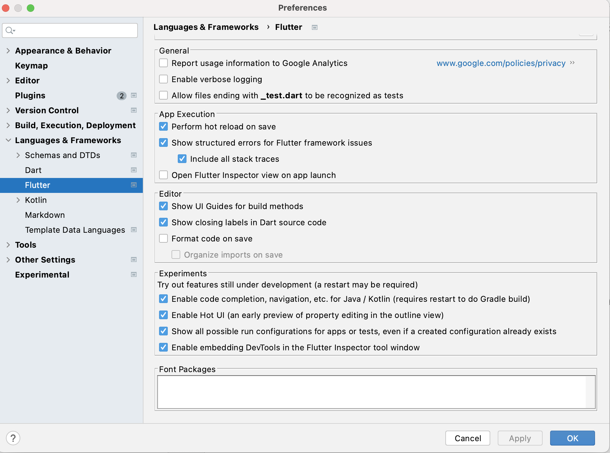
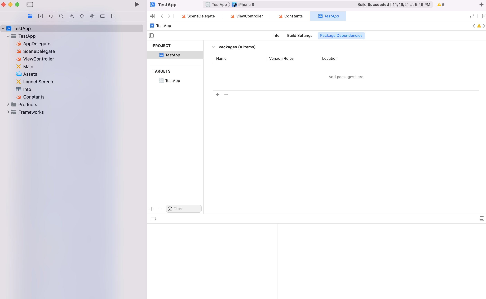
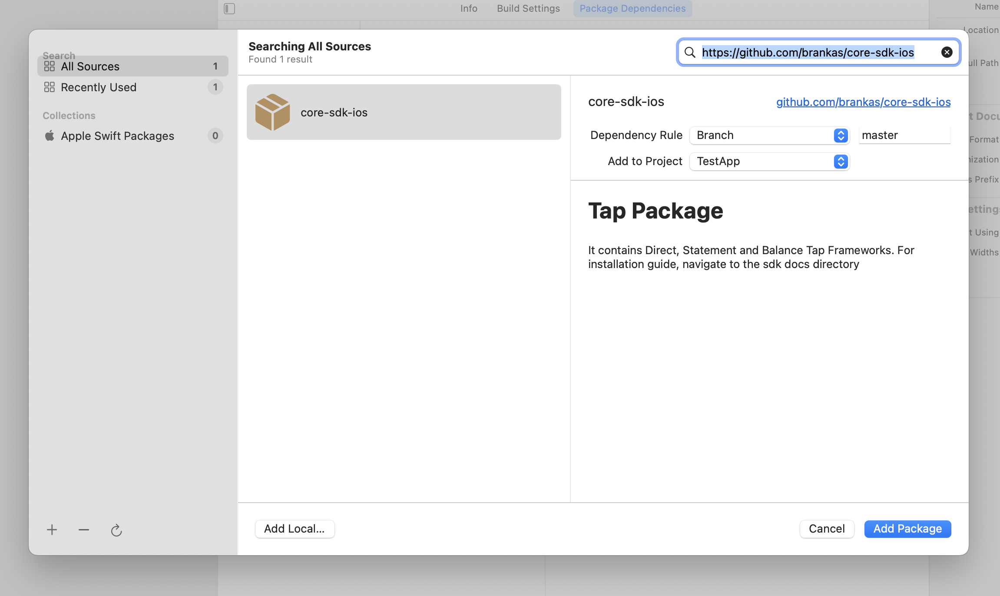
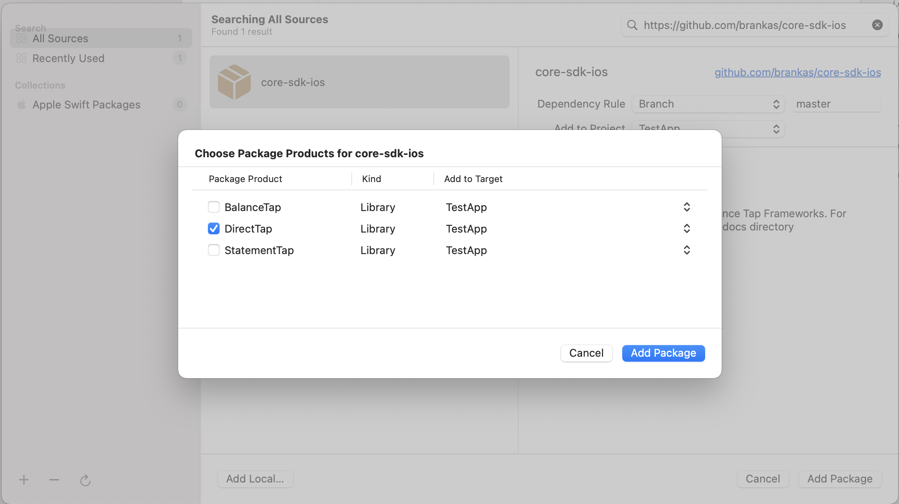
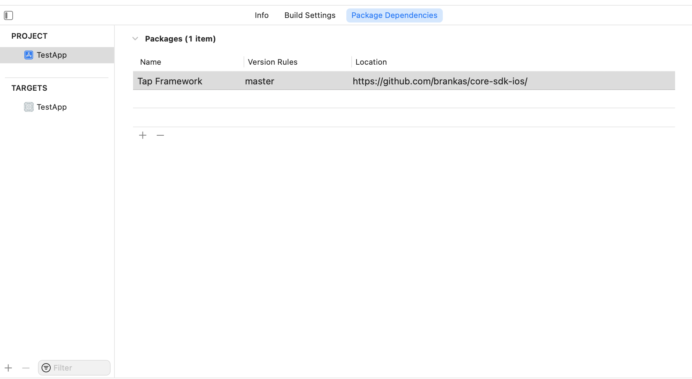
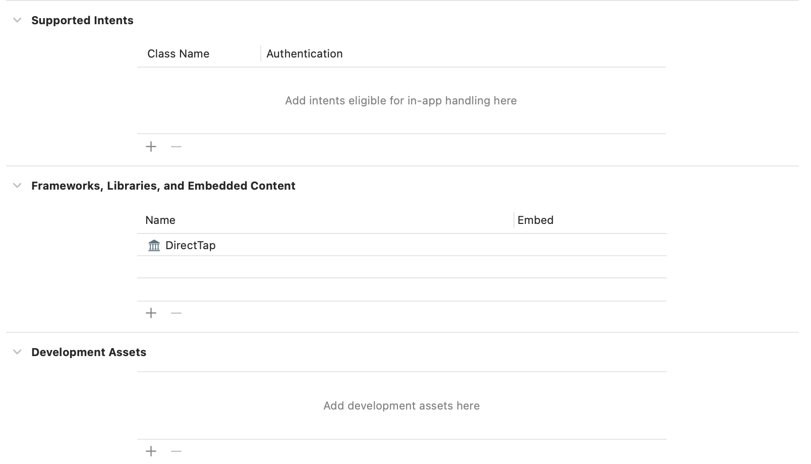

# core-sdk-flutter-sample

## Table of Contents

  1. [Minimum Requirements](#requirements)
  2. [Installation](#installation)
  3. [Notes](#notes)

***

## Minimum Requirements

1. **Android Studio Hedgehog** but preferably the latest version
2. Minimum Android SDK: **API 21** or **Android 5.0**
3. **Xcode 10.2** but preferably the latest version
4. Minimum Target iOS Deployment: **iOS 12**

## Installation

In order to run the sample mobile application in both Android and iOS Devices, the project has to be imported in both **Android Studio** and **Xcode**. These IDE's will be used to download the required dependencies and the SDK (Android) and Framework (iOS) themselves.

The next set of instructions assume that **Flutter** and **Dart** plugins are already downloaded and installed within Android Studio. If not done with that process, follow these steps: **https://docs.flutter.dev/get-started/editor?tab=androidstudio**

**To run on Android Device**:
1. Open Android Studio and import the project
2. In the project build.gradle, fill up the **username** and **password** with your GitHub Credentials.
3. Ensure that gradle build will be ran in order to download all the necessary dependencies. To set it up: Go to File > Settings > Search for ***'Flutter'*** > In Experiments Section, check all the checkboxes    
4. After libraries have been downloaded, the app can now be ran on an Android Device or Emulator

**To run on iOS Device**:
1. Open Xcode and import the project
2. Download Direct Tap Framework via Swift Package Manager. To integrate, click your project > **Package Dependencies**, then the '+' button   
3. On the search bar, enter the URL: **https://github.com/brankas/core-sdk-ios**. Wait for the repository to be loaded then click **Add Package**   
4. Check **DirectTap** then click on **Add Package**   
5.  Check if package has already been added as a dependency   
6. Go to **Frameworks, Libraries and Embedded Content** and check if the selected framework has been added   
7. The application can now be run on an iOS Device or Simulator

## Notes
1. For more detailed information on integrating the Android SDK, refer to this: https://github.com/brankas/core-sdk-android
2. For more detailed information on integrating the iOS Framework, refer to this: https://github.com/brankas/core-sdk-ios